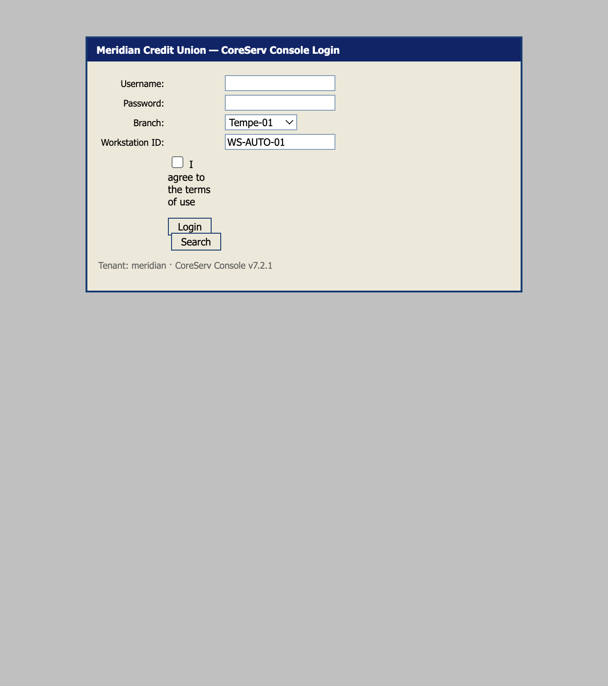
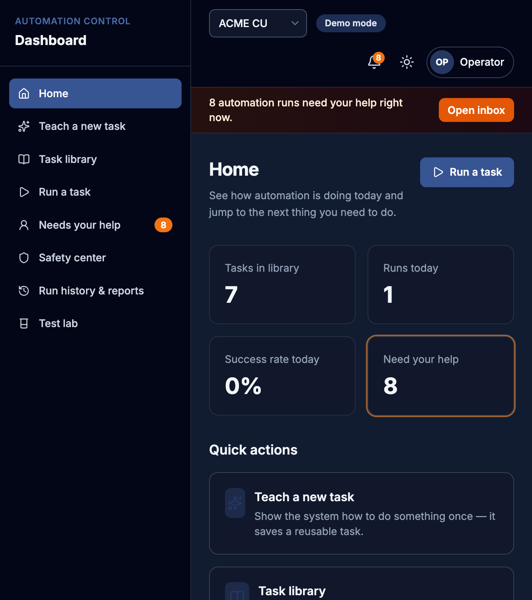
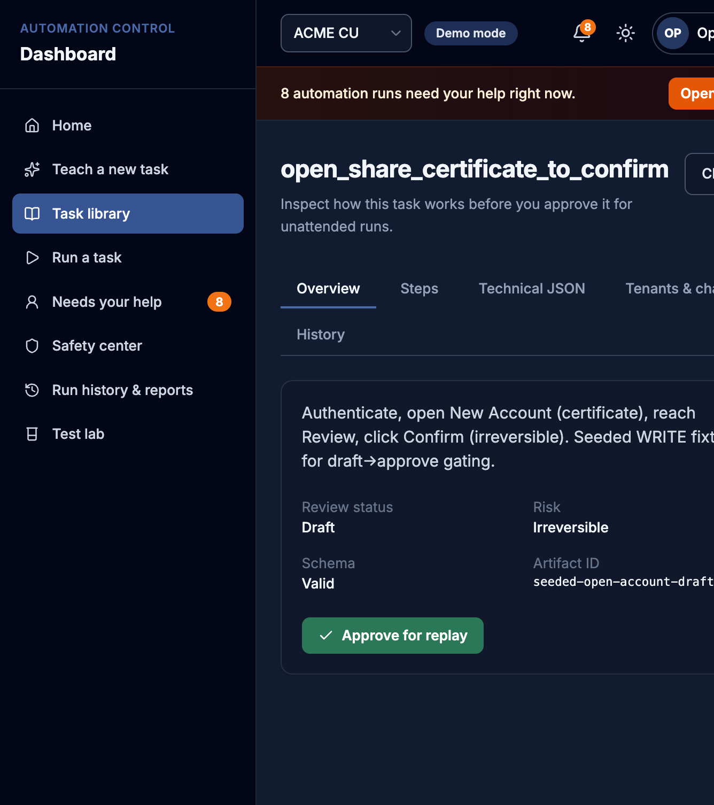
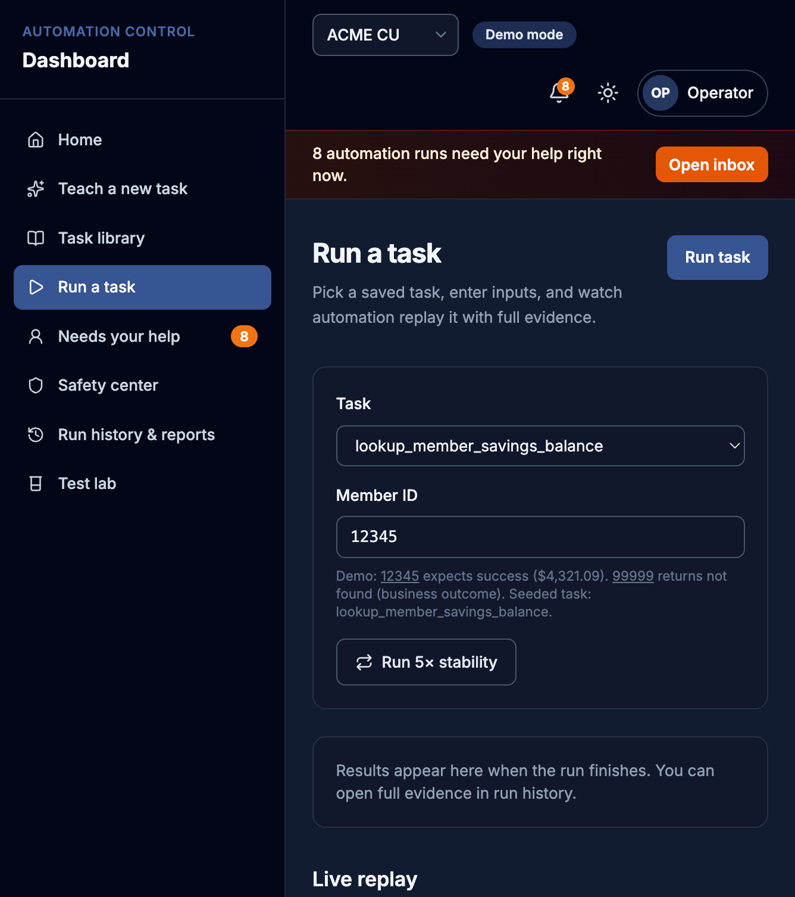
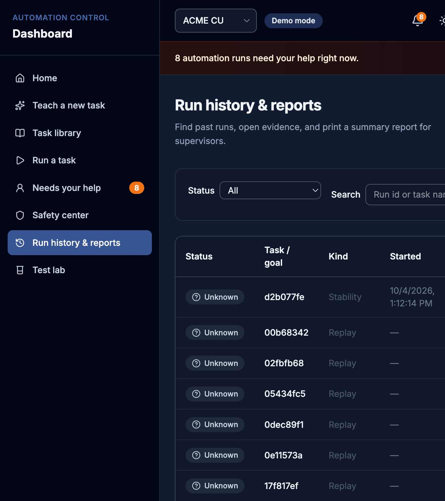
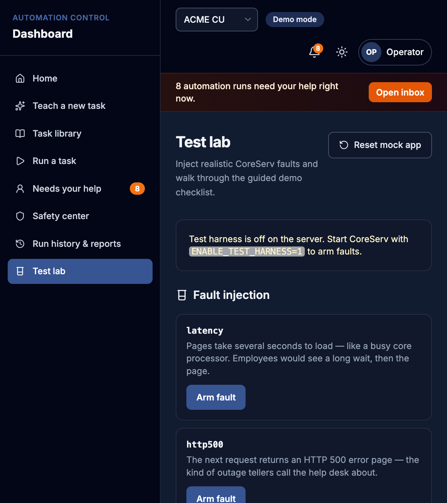

# 10-minute interview demo — exact click path

Screenshots live in [`docs/demo-screenshots/`](demo-screenshots/).

## Before you start (30s)

**Two terminals:**

```bash
# Terminal 1 — hostile bank target (keep this window visible but small)
ENABLE_TEST_HARNESS=1 npm start
# → http://localhost:4000

# Terminal 2 — operator dashboard
npm run dashboard
# → http://localhost:5050  (falls back here if macOS AirPlay owns :5000)
```

Open **two browser tabs**: CoreServ login + Dashboard Home.

Say: *“CoreServ is the deliberately hostile legacy bank. The dashboard is a thin UI over the same discovery → artifact → replay engine — nothing is reimplemented.”*

---

## Minute-by-minute script

### 0:00–0:45 — Open CoreServ + Home

| Click | Say |
|-------|-----|
| Tab: `http://localhost:4000/login` | “This is the real target app — unlabeled fields, frames, faults.” |
| Tab: `http://localhost:5050/` | “Employees never touch the terminal. Demo mode = no login system.” |
| Point at health strip + “Need your help” card | “Live health: CoreServ, Gemini key, safety rules, harness.” |





---

### 0:45–2:00 — Teach a new task (discovery)

| Click | Say |
|-------|-----|
| Sidebar **Teach a new task** | “Plain-English goal. Gemini observes → decides → acts once.” |
| Click example *Look up a member savings balance after login* | Goal fills in. |
| **Run preflight** | Shows CoreServ up, key present, allowlist OK, creds present (not shown). |
| *Timeboxed choice:* either **Start teaching run** (live, ~2–4 min) **or** say “I’ve already taught this — we’ll open the saved artifact” and skip to library | Live run: SSE timeline + screenshots. On success → “Task learned”. |


**Honesty line:** Live teach calls real Gemini and drives real Playwright against CoreServ. For a tight 10 minutes, prefer showing the form + preflight, then jump to an existing artifact.

---

### 2:00–3:30 — Verify in Task library (artifacts)

| Click | Say |
|-------|-----|
| Sidebar **Task library** | “Saved capabilities — versioned JSON under `artifacts/`.” |
| Open **`lookup_member_savings_balance`** (seeded or discovery) | Tabs: Overview → Steps → Technical JSON → Tenants → History. |
| Expand a step’s locators | “Ranked locators + rationale — replay uses these, not the LLM.” |
| Open **`open_share_certificate_to_confirm`** (draft / irreversible) | Banner: needs supervisor approval. |




| Click | Say |
|-------|-----|
| **Approve for replay** → confirm irreversible steps | “Gate: irreversible writes cannot run unattended until approved. Writes an audit entry.” |

---

### 3:30–6:00 — Run a task (replay, no AI)

| Click | Say |
|-------|-----|
| Sidebar **Run a task** | “Deterministic replay — badge: no AI during this run.” |
| Task = seeded lookup · Member ID **12345** · **Run task** | Watch live steps + screenshot. |
| Result card **Success** | Point at **$4,321.09** (or savings balance output). |
| Member ID **99999** · **Run task** again | **Blue business outcome** — “No member found is a valid answer, not a crash.” |



---

### 6:00–8:00 — Needs your help (human handoff)

| Click | Say |
|-------|-----|
| Sidebar **Test lab** → **Demo handoff** (or **Arm** MFA / stuck fault) | “Arms a real stuck run via existing demo-handoff / CoreServ faults.” |
| Banner / bell → **Needs your help** | Global alert is real SSE over the interventions store. |
| Open a **Pending** request → **Take control** | Claim → controller **YOU**. |
| Fix in the **headed Chromium window** (same session) | See honesty note below. |
| **Hand back to automation** | Resume → RESUMING → finish. |


---

### 8:00–9:00 — Safety center

| Click | Say |
|-------|-----|
| Sidebar **Safety center** | Allowlist from real config. |
| **Test a URL** with `http://localhost:4000/login` then `https://evil.example` | Real `assertAllowedUrl`. |
| Paste fake SSN/email in redaction box | Real `redactDeep` / `redactString`. |
| Approvals queue | Draft artifacts waiting. |


---

### 9:00–10:00 — History + close

| Click | Say |
|-------|-----|
| **Run history & reports** → open a Success run → **Report** | Printable evidence page. |
| Optional: **Test lab** guided checklist | Tick boxes as you go next time. |





**Close:** “Discovery uses Gemini once; every production-style run is replay with allowlist, redaction, and a human path when stuck.”

---

## Real vs not fully verified

| Piece | Status |
|-------|--------|
| CoreServ mock bank | **Real** hostile target (`src/mock-app`) — not restyled |
| Discovery (Teach) | **Real** Gemini + Playwright; needs `GEMINI_API_KEY` |
| Artifacts / evidence / interventions | **Real files** — no fake dashboard data |
| Replay | **Real** engine; **never** imports LLM client |
| Approve draft / irreversible gate | **Real** `updateArtifactReview` + audit file |
| SSE progress / handoff alerts | **Real** over run manager + intervention store |
| Allowlist + redaction preview | **Real** `assertAllowedUrl` / `redactString` |
| Test lab faults | **Real** CoreServ `/__test/*` when harness on |
| Demo mode / Operator chip / tenant labels ACME·Contoso | **UI chrome** (no auth product); replay tenant still uses engine overrides |
| Handoff live control | **MVP: headed Chromium window** + dashboard screenshot refresh / instructions — **not** full in-page CDP screencast + click forwarding (spec “BETTER” path not shipped) |
| Guided checklist ticks | **Local** (`localStorage`) — deep-links are real routes |
| Screenshots in this folder | Captured from the **running** app on :5050 / :4000 |

---

## Timing tip if discovery is slow

Full live teach can blow the 10 minutes. Preferred interview cut:

1. Show Teach form + preflight (30s)  
2. Library artifact from prior discovery / seeded lookup  
3. Replay 12345 + 99999  
4. Draft approve **or** Demo handoff  
5. Safety + one report  

That still hits every product claim without waiting on Gemini.
